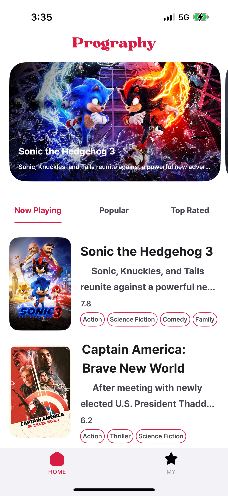
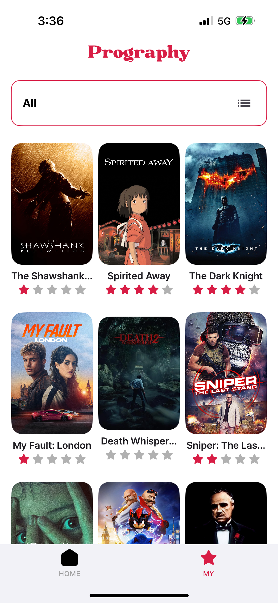
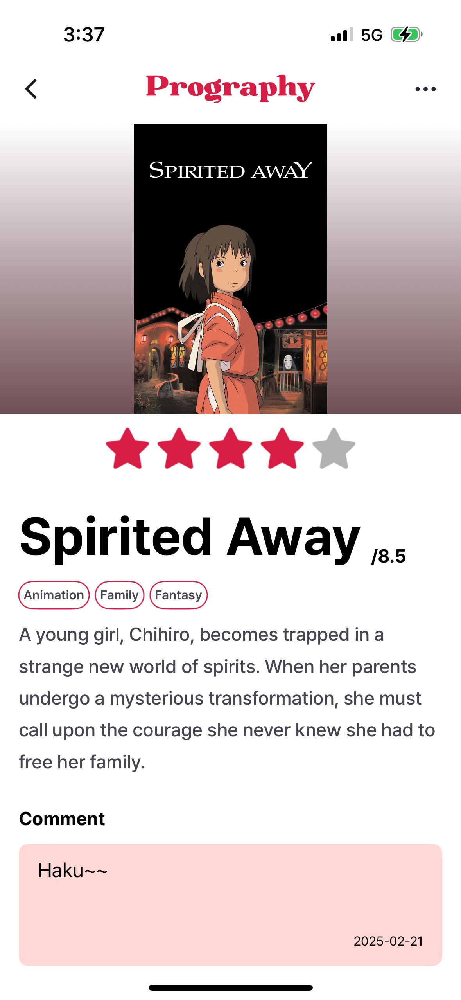
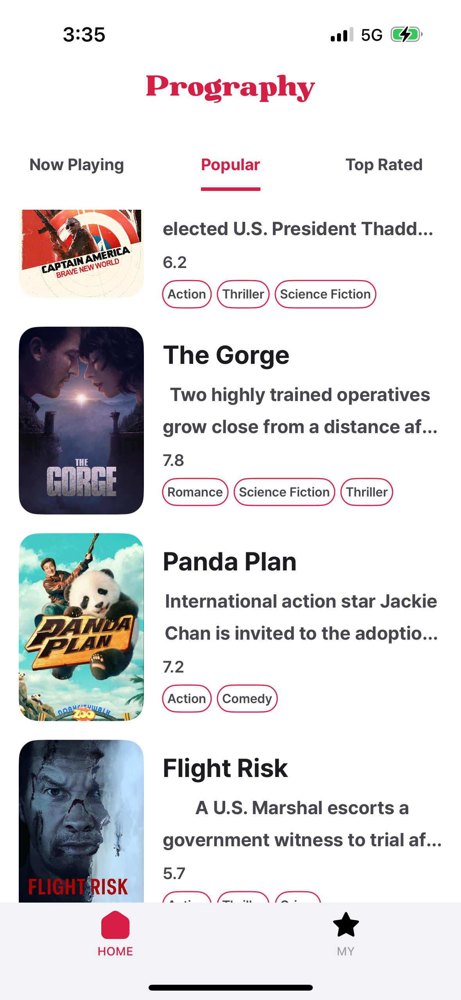
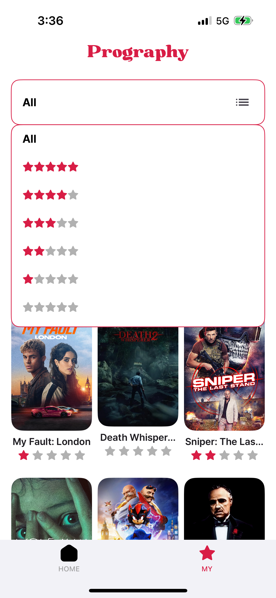
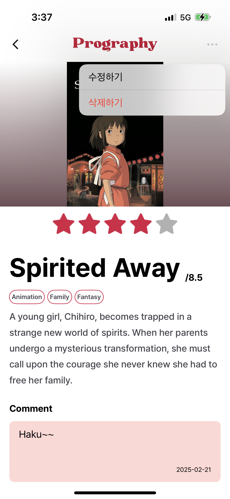
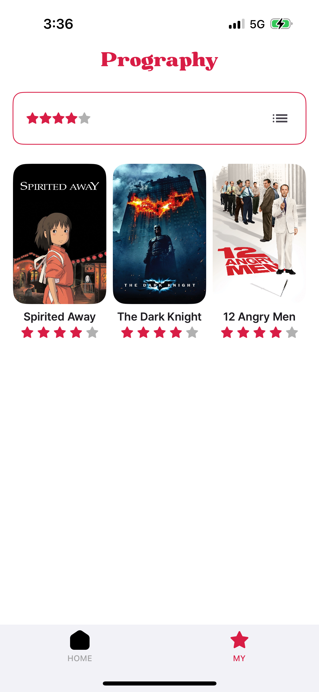
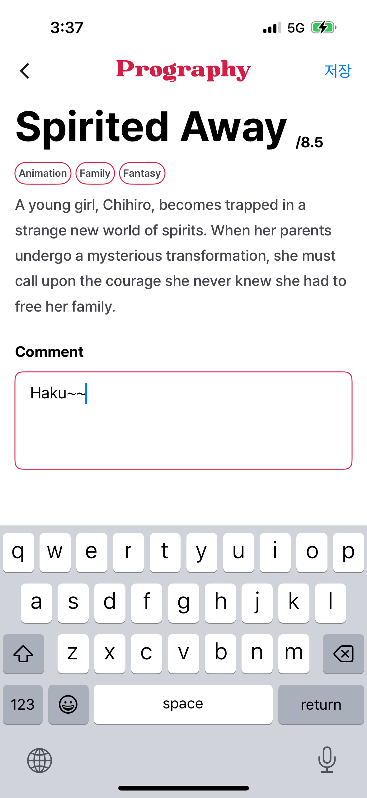

#  MovieReview

프로그라피 10기 iOS 과제전형
- 현재 상영 중, 인기, 최고 평점 영화 조회
- 리뷰 작성 및 작성한 리뷰 조회/수정/삭제

## 앱 실행 방법

API 키를 포함한 *.xcconfig 파일 추가:  
`MovieReview/App/Resources/Secrets.xcconfig`
```
  API_AUTH_TOKEN = xxxxxxxxxxxxxxxxxx
```
API 키는 [The MovieDB Website](https://developer.themoviedb.org/docs/getting-started)에서 발급받을 수 있습니다.

## 주요 기술 스택

- SwiftUI: 선언형 UI 구현
- UserDefaults: 로컬 데이터베이스 관리
- Swift Concurrency: 비동기 네트워크 요청 및 데이터 처리
- [TCA (The Composable Architecture)](https://github.com/pointfreeco/swift-composable-architecture): 단방향 상태 관리, 기능 모듈화, 의존성 주입
- [Nuke](https://github.com/kean/Nuke): 네트워크 이미지 로딩 및 캐싱

## 프로젝트 폴더 구조

```plaintext
MovieReview
│── App/                     # 앱의 최상위 엔트리 포인트
│── Domain/                  # 핵심 도메인 로직 관리
│   └── Movie/               # 영화 관련 도메인 로직
│── Features/                # 각 기능(Feature)별 UI 및 비즈니스 로직
│   ├── Detail/              # 영화 상세 페이지
│   ├── Home/                # 홈 화면 (영화 목록)
│   ├── Main/                # 메인 화면 (탭뷰)
│   └── MyPage/              # 마이 리스트 화면
│── Network/                 # 네트워크 관련 코드
│── UI/                      # 공통 UI 컴포넌트
└── Util/                    # 유틸리티 기능 (날짜 포맷 변환 등)
```
### Demo

| Main Screen | Detail Screen |
|-----------|-----------|
|  |  |
|  |  |
|  | |

## 화면 스크린샷

| Home Screen | My Screen | Detail Screen |
|------------|---------------|----------------|
|  |  |  |
|  |  |  |
|  |  |  |

## Supported Platforms


## License

MIT
